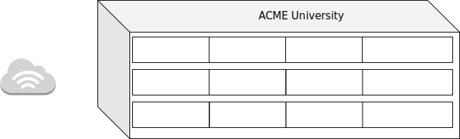

# Zadanie 2

## Projekt sieci lokalnej dla jednostki dydaktycznej uniwersytetu

### Cel Projektu
  Zaprojektowanie i weryfikacja działania sieci w środowisku testowym. 
  Rozwiązanie zapewnia dostęp do internetu dla wszystkich urządzeńw infrastrukturze.
  
### Założenia projektu

* Sieć zlokalizowana jest w budynku 3 kondygnacyjnym
* Na kążdej z kondygnacji znajdują się laboratoria komputerowe kolejno:
  * poziom 0 
    * 009, 013, 014
  * poziom 1
    * 115, 116, 117, 122
  * poziom 2
    * 201, 202, 203 
* Każde z laboratoriów wyposażone jest w 35 stanowisk dla uczestników kursów
* Jednostka planuje otworzenie kolejnych laboratoriów 017 oraz 204
* Każda kondygnacja wyposażona jest w izolowaną sieć Wi-Fi, udostępniajacą sieć internet podłączonym gościom
  * Sieć Wi-Fi nie pozwala na bezposrednią komunikację z urządzeniami zlokalizowanymi w pozostałej części sieci,
    tj: laboratoria, serwery jednostki
  * Prognozowana maksymalna liczba jednoczesnych urządzeń podłączonych do sieci to ``800``
* Jednostka posiada przyłącze internetowe oraz dysponuje pulą adresów ``188.156.220.160/27``
* Jednostka posiada serwery udostępniajace zasoby do celów dydaktycznych i promocyjnych
  * serwery zlokalizowane są w osobnym pomieszczeniu
  * udostępniają zasoby w sieci publicznej z wykorzystaniem sieci ``188.156.220.160/27``
  * Jeden serwer pełni rolę bramy dla urządzań w sieci lokalnej ``LAN``

### Wstępne założenia

* Każde laboratorium posiada oddzielną podsieć pozwalającą efektywnie zidentyfikować urządzania
  * kondygnacja oraz sala
* Dla uniknięcia zbyt słabego zasięgu sieć WiFi zostanie wyposażona w 4 urządzenia nadawcze na każdej kondygnacji
 

#### zadanie - wymaganai

* Dokonaj podziału i projektu sieci w formie dokumentu w formacie ``MARKDOW`` zawierającego specyfikację tekstową oraz obrazkową
  projektowanej sieci
* Przygotuj prototyp rozwiązania z wykorzystaniem oprogramowania ``VirtualBox`` lub podobnego.
* W specyfikacji uwzględnij wielkości sieci oraz ich adresy
* W specyfikacji uwzględnij konfigurację tablicy routingu
* Dokumentację graficzną stworzonej architektury przygotuj w programie ``DIA`` lub podobnym

ROZWIAZANIE
--- 
Podzielono sieć 188.156.220.160/27 na 2 podsieci:
* 188.156.224.160/23  sieć dla sal, ilość hostów: 510(wymagana liczba 420)
	* podsieć: 10.0.0.0/16
* 188.156.220.160/22 sieć wifi, ilość hostów 1022(wygana liczba 800)
	*	podsieć: 10.10.0.0/22

Adresy każdej z sal:
---
* 009: 10.0.9.0/26
* 013: 10.0.13.0/26
* 014: 10.0.14.0/26
* 017: 10.0.17.0/26
* 115: 10.0.115.0/26
* 116: 10.0.116.0/26
* 117: 10.0.117.0/26
* 122: 10.0.122.0/26
* 201: 10.0.201.0/26
* 202: 10.0.202.0/26
* 203: 10.0.203.0/26
* 204: 10.0.204.0/26
* kazda sala pomieści 64 komputery(wymagana liczba 35)

* na każdym piętrze znajduje się po 140 komputerów co łącznie daje 420 komputerów.

 ip forwarding
----
 ``echo 1 >/proc/sys/net/ipv4/ip_forward``
 
 
DHCP
---
* instalacja dhcp
``apt install isc-dhcp-server``  
* usuwamy znak komentarza przy configu DHCPv4 ``config DHCPDv4_CONF`` 

Routing
---
* ``ip route add default via 10.0.115.1``  
* ``ip route add default via 10.0.201.1``
* ``ip route add default via 10.0.9.1``
* ...

 
 Reguła Masquerade
 ---
 * ``iptables -t nat -A POSTROUTING -s 188.156.220.160/22 -o enp0s3 -j MASQUERADE``
 * ``iptables -t nat -A POSTROUTING -s 188.156.224.160/23 -o enp0s3 -j MASQUERADE``
 
Diagram 
--- 

