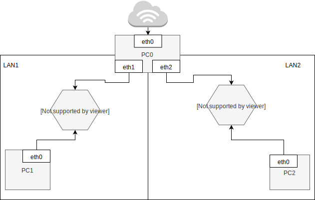

Zadanie 1
---------

1. Zaprojektuj oraz przygotuj prototyp rozwiązania z wykorzystaniem oprogramowania ``VirtualBox`` lub podobnego. 
Zaproponuj rozwiązanie spełniające poniższe wymagania:
   * Usługodawca zapewnia domunikację z siecią internet poprzez interfejs ``eth0`` ``PC0``
   * Zapewnij komunikację z siecią internet na poziomie ``LAN1`` oraz ``LAN2``
   * Dokonaj takiego podziału sieci o adresie ``172.22.128.0/17`` aby w ``LAN1`` można było zaadresować ``500`` adresów natomiast w LAN2 ``5000`` adresów    
   * Przygotuj dokumentację powyższej architektury w formie graficznej w programie ``DIA``
   Rozwiązanie zadania:
 -------------------------------------------
 Podział sieci na 2 podsieci:
---
 - LAN 1: 172.22.160.0/23
 - LAN 2:172.22.128.0/19

Konfiguracja komputera PC0
 --------------------------------
 Polecenia użyte przy konfiguracji:

- ip a add 172.22.160.1/23 dev enp0s3 
- ip a add 172.22.128.1/19 dev enp0s8 (czyli LAN2)
- ip link set enp0s3 up
- ip link set enp0s8 up
- ip link set enp0s9 up
- iptables -t nat -A POSTROUTING -s 172.22.160.0/23 -o enp0s3 -j MASQUERADE
- iptables -t nat -A POSTROUTING -s 172.22.128.0/19 -o enp0s3 -j MASQUERADE

 Konfiguracja komputera PC1
 --------------------------------
  Polecenia użyte przy konfiguracji:
- ip a add 172.22.160.100/23 dev enp0s3
- ip route add default via 172.22.160.1

 Konfiguracja komputera PC2
 ---------------------------------
Polecenia użyte przy konfiguracji:
- ip a add 172.22.128.100/19 dev enp0s3
- ip route add default 172.22.128.1

Rezultat końcowy potwierdzający poprawność konfiguracji
------------------------------------

Diagram w programie Dia
--------------

 
